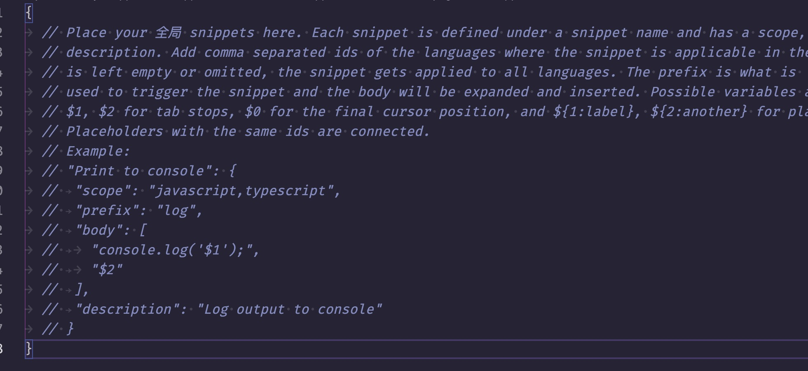
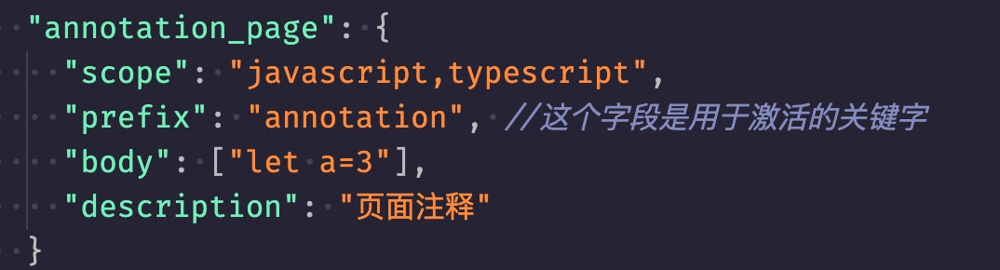

# 如何在 vscode 中定义便捷的代码片段

- 步骤一：打开 vscode=>点击左上角的「文件」=》 「首选项」=》[代码片段] => 「选择或新建一个文件」 。打开后如下
  
- 步骤二:访问[vscode 代码片段格式化工具的网页](https://xulzu.github.io/easyCodeSnippets/)，在输入框黏贴你需要定义的代码片段，把输出结果整个复制到下面的图中的 body 里面,注意 prefix 字段就是用来唤醒某一段代码的
  
- 最后：设置完保存后回到其他文件下输入 prefix 中的内容，就会弹出只能提醒，选择对应的片段即可
